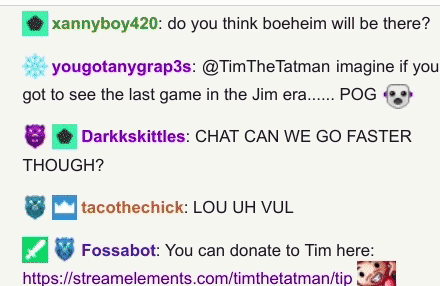
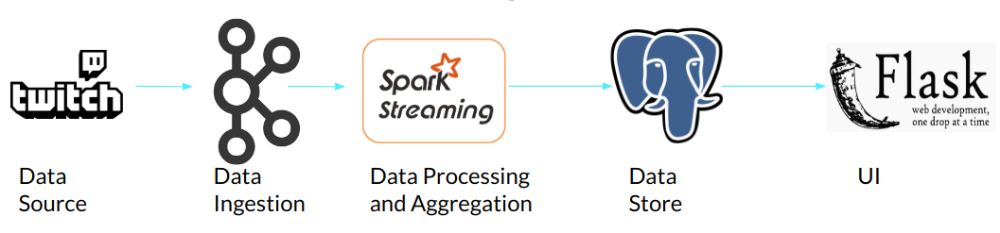

# Live-Dash
Stream processing pipeline for analyzing live chat data from Twitch IRC

## Providing actionable insights to live streamers
- Live video channels receive thousands of messages every minute and it is difficult to read and make sense of these messages 

- This project aims to create a dashboard to help streamers identify insights 
- This can help streamers in identifying the audience engagement 

## Architecture

Live-Dash runs on the AWS cloud, using the following cluster configurations:

- 1 t2.large RDS PostgreSQL instance
- 3 m4.large EC2 instances for Kafka brokers and Kafka producers
- 3 m4.large EC2 instances for Spark 
- 1 t2.medium Web-Server

## Setup
- I used pegasus to spin up my clusters. You might want to read [the following](src/README.md)
to setup the enviornment on your localhost to test this out. 

## UI (Still there is lots of room for improvement!)

	
Presentation: https://docs.google.com/presentation/d/1INdVuo4dWy8_kH3LWE4OG17gV1afsJEOIk5Sf8z17dE/edit?usp=sharing
